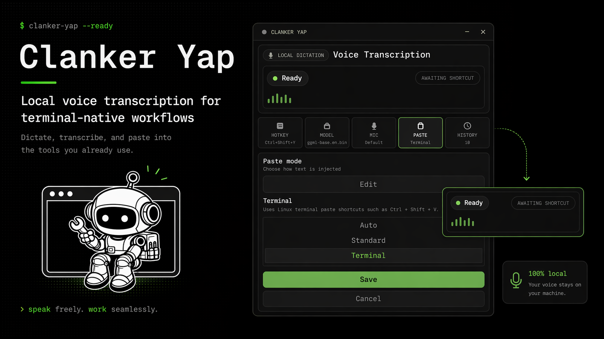

# Clanker Yap

<p align="center">
  
</p>

**Clanker Yap** is a local-first push-to-talk dictation app for people who live in terminals, editors, and desktop workflows.

Hold a hotkey, speak, release, and your text is transcribed locally and pasted into the app you already have focused.

## Why Clanker Yap?

- **100% local transcription** — your audio stays on your machine
- **Fast push-to-talk workflow** — hold to record, release to paste
- **Built for real desktop use** — works across apps, not just inside one editor
- **Terminal-friendly paste modes** — better behavior for shells and terminal apps
- **Minimal UI** — configure it once, then mostly forget it exists

## How it works

```text
Hold hotkey → record → release → transcribe locally → paste text
```

Default hotkey: `Ctrl+Shift+V`

## Features

- Local speech-to-text with `whisper.cpp` via `whisper-rs`
- Global push-to-talk shortcut
- Floating recording overlay with live mic level visualization
- Clipboard + paste injection
- Paste modes for standard apps and terminals
- SQLite-backed settings, transcription history, and cumulative word count
- Built-in model download support for `ggml-base.en.bin`
- Single-instance desktop behavior

## Privacy

Clanker Yap is designed to run **entirely on-device**.

- No cloud transcription
- No audio upload
- No account required
- No external service in the transcription path

## Current status

Clanker Yap is actively developed and currently ships as a **Linux x86_64 AppImage**.

Release confidence notes for `0.1.0`:
- **Wayland:** smoke tested
- **X11:** smoke tested
- **macOS / Windows:** not yet supported as release targets

## Quick start

### 1) Install dependencies

#### Arch / CachyOS

```sh
sudo pacman -S --needed base-devel cmake webkit2gtk-4.1 libappindicator-gtk3 librsvg nodejs npm
```

#### Debian / Ubuntu

```sh
sudo apt install build-essential cmake libwebkit2gtk-4.1-dev libappindicator3-dev librsvg2-dev nodejs npm
```

#### Fedora

```sh
sudo dnf install gcc-c++ cmake webkit2gtk4.1-devel libappindicator-gtk3-devel librsvg2-devel nodejs npm
```

Also install:

- Rust stable toolchain
- Node.js and npm

### 2) Clone and install

```sh
git clone https://github.com/Bynzski/clanker-yap.git
cd clanker-yap
npm install
```

### 3) Run the app

```sh
npm run tauri:dev
```

### 4) Download a Whisper model

Clanker Yap expects a local GGML Whisper model. The default path is:

```text
~/.local/share/voice-transcribe/ggml-base.en.bin
```

You can either:

- download it from inside the app, or
- download it manually from [whisper.cpp on Hugging Face](https://huggingface.co/ggml-org/whisper.cpp/tree/main)

## Basic usage

1. Open any app where you want text inserted
2. Hold the global hotkey
3. Speak
4. Release the hotkey
5. Clanker Yap transcribes locally and pastes the result

## Build

For development:

```sh
npm run tauri:dev
```

For production builds on Arch-based systems, use:

```sh
npm run tauri:build
```

> `tauri:build` already includes the required `NO_STRIP=1` workaround for Arch/CachyOS AppImage builds.

## Documentation

Top-level release docs:

- [CHANGELOG.md](CHANGELOG.md)
- [RELEASING.md](RELEASING.md)

More detailed docs live in [`docs/`](docs/):

- [Quick Start](docs/quick-start.md)
- [Getting Started](docs/getting-started.md)
- [Configuration](docs/configuration.md)
- [Whisper Models](docs/whisper-models.md)
- [Troubleshooting](docs/troubleshooting.md)
- [Development](docs/development.md)
- [Architecture](docs/architecture.md)
- [Release Checklist](docs/release-checklist.md)

## Tech stack

- **Tauri v2**
- **Rust** backend
- **Vanilla HTML/CSS/JS** frontend
- **whisper-rs / whisper.cpp** for local transcription
- **SQLite** for settings and history

## Contributing

See [CONTRIBUTING.md](CONTRIBUTING.md).

## License

See [LICENSE](LICENSE).
